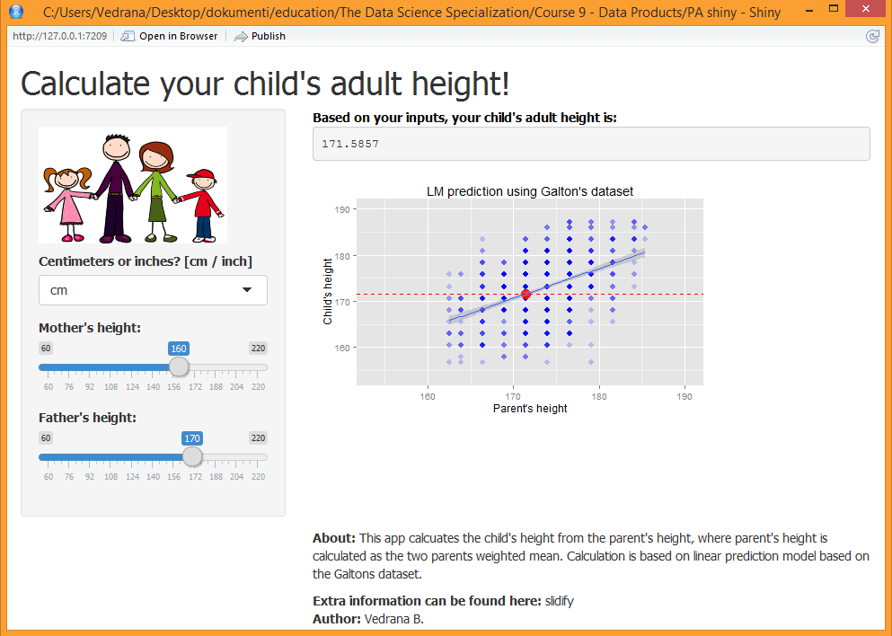

## Predict your child's adult height

Vedrana B.

The Data Science Specialization: Developing Data Products


17.05.2015.

---

## OVERVIEW

- Problem description: 
  
  - predict a child's adult height based on parent's heights


- Problem solution:
  
  - linear model fit on the Galton's dataset
  
  - SHINY application available online

---

## Galton's dataset (1)

- Famous 1885 study of Francis Galton exploring the relationship between the heights of children and their parents. 

- The variables are:

  - the height of the adult child and 
  
  - the midparent height, defined as: $$hParent = \frac{hFather + 1.08*hMother}{2}$$
  
- The units are inches. 

- The number of cases is 928, representing 928 children from 205 parents.

---

## Galton's dataset (2)

- Data preview (interactive rCharts scatterplot):

```{r locate, echo=FALSE}
setwd("C:/Users/Vedrana/Desktop/dokumenti/education/The Data Science Specialization/Course 9 - Data Products/MyFirstSlidfy/")
```

```{r graph1, results = 'asis', message = FALSE}
library(UsingR); require(base64enc); require(rCharts)
data(galton)
options(RCHART_WIDTH = 600, RCHART_HEIGHT = 300)
knitr::opts_chunk$set(comment = NA, results = 'asis', tidy = F, message = T)

g1 <- nPlot(child ~ parent, data = galton, type = 'scatterChart')
g1$show('inline', include_assets = TRUE)
```

---

## Prediction model (1)

- Linear model = linear relationship between input variable (parent height) and the output (child height)

 $$hChild = \alpha * hParent + \beta$$

- where to build the model:

  - $hParent$ and $hChild$ are taken from the datasets

  - $\alpha$ and $\beta$ are model parameters calculated so that the data fits the equation with the minimal sum of squared residuals

---

## Prediction model (2)

- chunk of R code for building the model and for predicting:

```{r code, fig.height = 4, fig.width = 5, eval=FALSE}
model <- lm(formula = child ~ parent, data = galton2)
p     <- (as.numeric(input$hF) + 1.08*as.numeric(input$hM))/2
c     <- predict(model, data.frame(parent = p))
```

--- .class #id 

## Prediction model (3)

- Plot of the linear model fit to the Galton data in inches:

```{r plot2, fig.height = 4, fig.width = 6}
library(ggplot2)
limits <- c(min(galton)-1,max(galton)+1)
ggplot(data = galton, aes(x=parent,y=child))             + 
    geom_point(color = "red", alpha=0.2, size=3)         +
    labs(x = "Parent\'s height", y = "Child\'s height")  +
    labs(title ="LM prediction using Galton\'s dataset") + 
    coord_cartesian(xlim = limits, ylim = limits)        +
    geom_smooth(method='lm')                             +
    guides(color = FALSE, fill = FALSE) 
```

---

## Interactive SHINY web app

- Screenshot:



- Available at: http://vedra.shinyapps.io/PAshiny/ 


---

### REFERENCES:


- Materials on LM prediction, Shiny, Slidify etc: www.coursera.com

- Descritpion of dataset: http://www.math.uah.edu/stat/data/Galton.html

- Image source: www.pixshark.com

---

Thank you!

---
